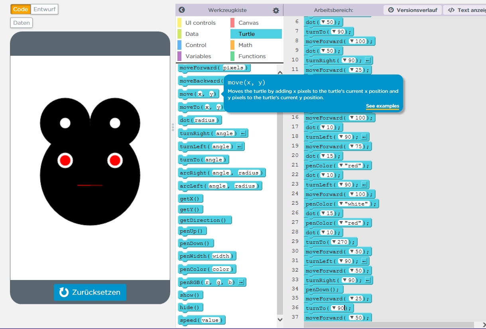
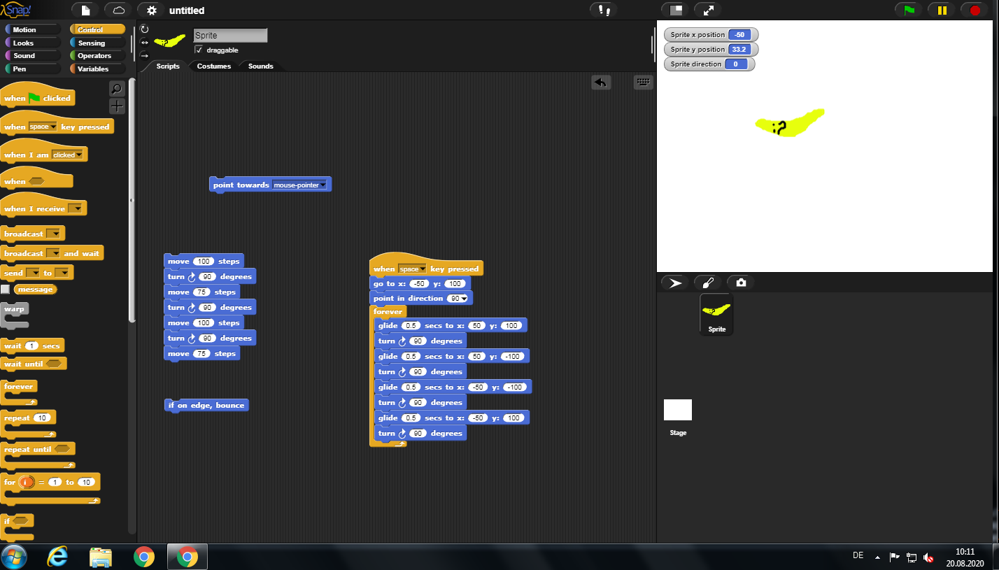
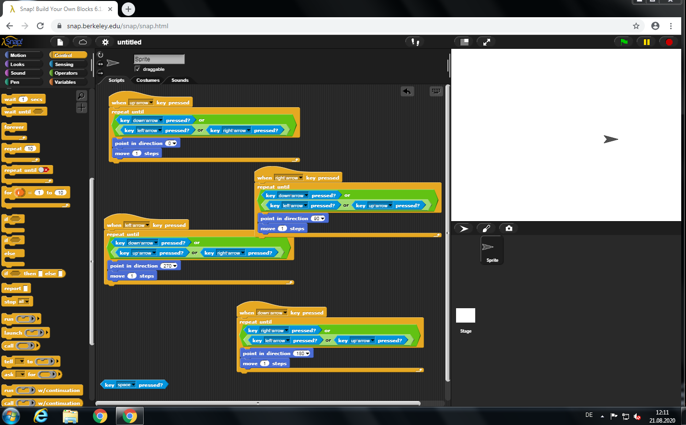
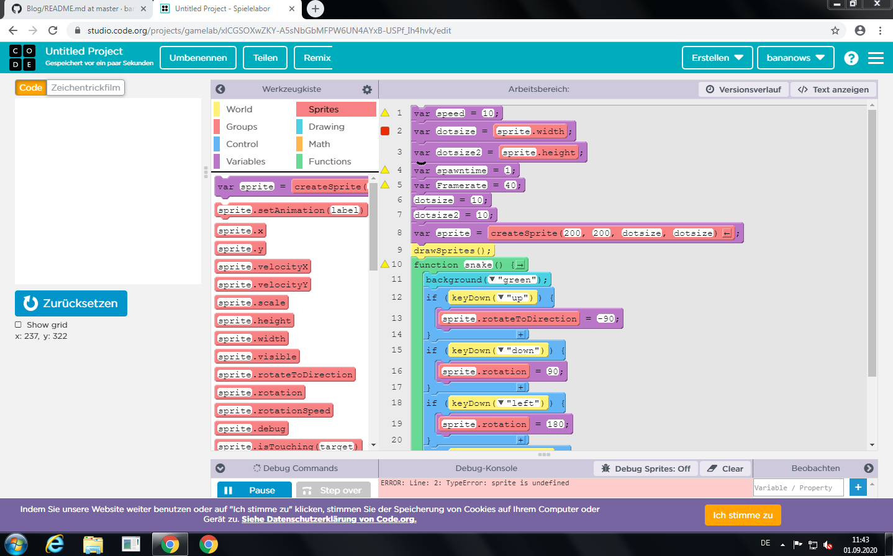
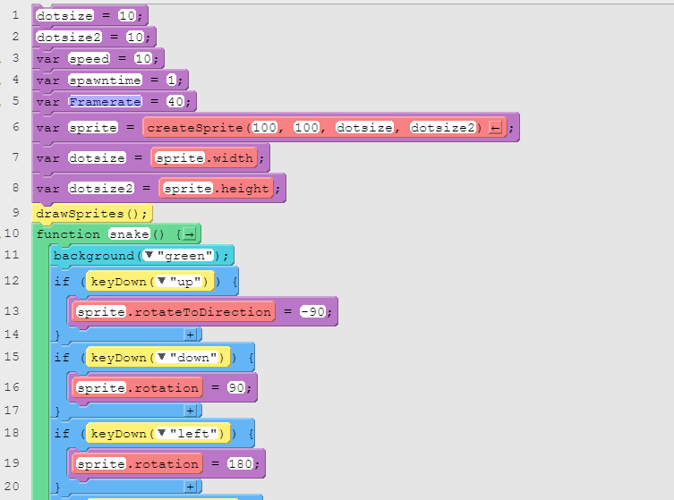
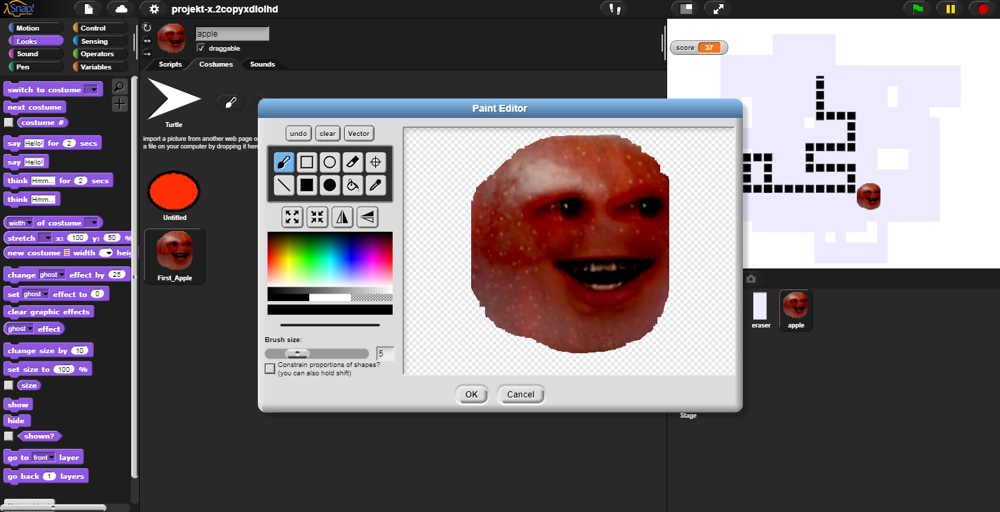
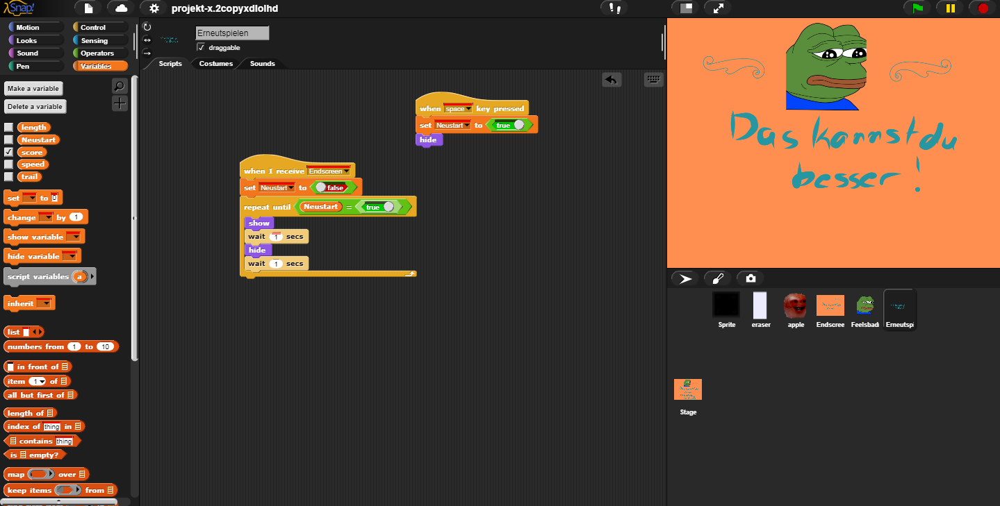
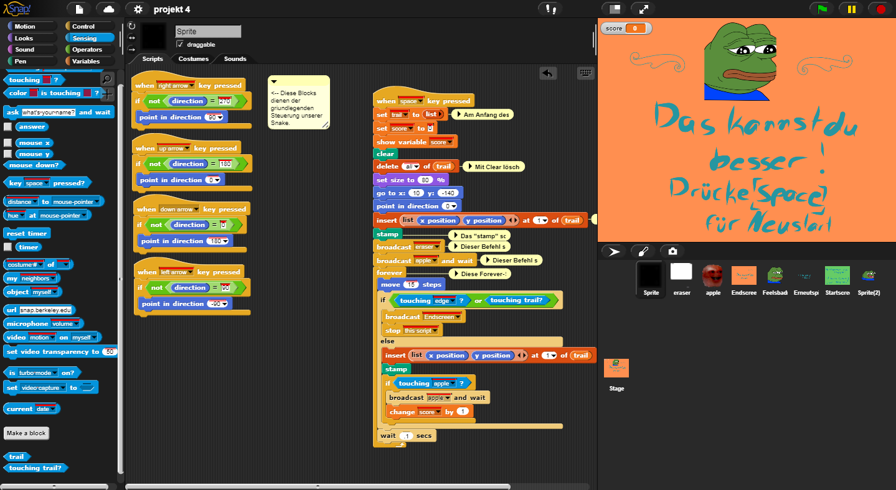

# Blog
Di 11.08.2020 Heute wurde uns das Konzept des Informatikunterrichts erklärt und uns wurden Links zu GithubProjekten vorher gegangener Jahrgänge gegeben, bei welchen wir uns ihre Beispiele angucken konnten.

DO 13.08.2020 In der heutigen Stunde haben wir uns zu Beginn einen Github-Account erstellt und uns mit der Seite vertraut gemacht. Das erste, was wir gemacht haben, war es, 2 ReadMe.md Dateien zu erstellen für unseren Blog und unser Projekt. Anschließend haben wir uns erste Gedanken zu unserem Projekt gemacht. Wir haben unter anderem darüber nachgedacht, eine IOS-App zu erstellen, da wir beide leidenschaftliche Apple-User sind. Da dies jedoch mit einigen Hürden verbunden war, haben wir uns dagegenentschieden. 

FR 14.08.2020 Heute haben wir uns ein Appkonzept überlegt. Wir planen eine Art Snakespiel zu programmieren, in welchem verschiedene Effekte und Bilder einintegriert werden sollen. Zuerst haben wir uns auf der Programmiersprache Snap! umgesehen aber nach Beratung von Herrn Buhl haben wir uns vorerst für Applab entschieden.

DI 18.08.2020 Heute war Bjarne nicht da und deswegen habe ich die Stunde genutzt, um mich etwas näher mit der Programmiersprache Applab bekannt zu machen. Ich habe mich an eine kleine Figur gewagt und das hat auch ganz gut geklappt.

DO 20.08.2020 Heute war ich erneut alleine und habe mich mal in der Programmiersprache Snap! versucht. Ich habe mir einzelne Befehle angesehen und erste Versuche zur Beweung der Figur gemacht. Mit Applab habe ich nun noch nicht viel gearbeitet und mit Snap auch nicht, jedoch sagte mir mein erster Eindruck, dass Snap deutlich entgegenkommender ist. Wie wir weiter vorgehen und mit welchem Programm wir arbeiten, werde ich demnächst zusammen mit Bjarne entscheiden.

FR 21.08.2020 Heute habe ich mich mit der Programmierung der Grundbewegung eines Snake-Spiels beschäftigt und habe dies auch erfolgreich hinbekommen. Die Blocks, um die Figur  in eine jeweilige Richtung steuern zu lassen bis eine andere Pfeiltaste gedrückt wird, sind nun da.

Di 25.08.2020 Heute haben wir unseren Github-Account mit einigen Screenshots erweitert. Zudem haben wir uns einen Snap!-Account angelegt, da wir dadurch unser Projekt auf dieser Seite speichern konnten. Uns ist ein Problem bei unserer bisherigen Programmierung aufgetreten. Undzwar stoppt das Objekt seine Bewegung komplett sobald man mehrere Eingaben gleichzeitig tätigt. Danach haben wir versucht eine zufällig spawnede Variable zu kreieren, sind allerdings nicht besonders weit gekommen. 

Do 27.08.2020 Heute haben wir Recherche betrieben bezüglich Snake und andere Projekte verschiedener Creator betrachtet. Hierbei haben wir eine coole Umsetzung eines Programmierers bei Code gefunden, was uns über einen erneuten Plattformwechsel nachdenken lässt. https://studio.code.org/projects/gamelab/CLd3Z9H1toyK0An8fEKjVA6T2mJejD34rcUhHzu680g/view
Bei diesem Projekt werden viele Einzelcharakter hergestellt und als Gruppe deklariert, wodurch dann eine Schlange entsteht.

Fr 28.08.2020 Heute haben wir bei Code.org versucht den Anfang des Spiels zu programmieren. Zu diesem Zweck haben wir uns das gestern verlinkte Programm noch einmal im Detail angesehen und versucht einen Bug beim Code zu reparieren. 
Di 1.09.2020 Heute haben wir versucht die Dotsize zu definieren, da der Punkt noch zu groß ist, um für ein spielbares Erlebnis zu sorgen. 
//(Screenshot)

Die Lösung des Problems war die Reihenfolge, in der wir die Befehle angeordnet haben, da das Programm die Befehle lediglich linear ausliest und Variablen nur berücksichtigt, wenn diese am Anfang stehen. Deshalb haben wir nun alle Variablen an den Anfang verschoben. (Siehe Screenschot 2)

Do 3.09.2020 Heute haben wir versucht, dass unser Sprite nicht einen langen Strich hinter sich her zieht dann als einzelner Punkt angezeigt wird. Dabei wolten wir eine ähnliche Programmierung, wie die Mausgrafik vom 18.08.2020 benutzen. Leider haben wir für unser bisherige Programmierung Gamelab verwendet und die Maus aus der Stunde vom 18. war mit Applab programmiert, was mit anderen Bausteinen verbunden war. Im Gamelab gibt es andere Bausteine als im Applap.
Aus Frustration sind wir probehalber zurück zu SNAP! gegangen und haben den Tag, welche uns zum Wechseln gebracht hat entfernt,so dass die Sprite nicht mehr aufhört zu laufen,wenn man zwei Eingaben auf einmal tätigt. Die Lösung war eine weitere unabhängige automatisch erneut abgefragt die Schleife, die die Vorwärtsbewegung beinhaltet. Außerdem haben wir es geschafft eine Schlange aus ganz vielen Klonen unseres Sprite zu bauen, diese Lösung ist allerdings sehr rechenintensiv und deshalb in unserer bisherigen Form nicht umsetzbar. 

//[!!Fr 4.9.2020!!]

Di 8.9.2020 Heute haben wir Recherchen bezüglich der Listenfunktion betrieben ,um damit eventuell unser Cloneproblem zu lösen. 

Do 10.9.2020 Heute wollten wir unsere Freistunden nutzen um am Projekt weiter zu arbeiten, jedoch ist leider das Internet in der Schule ausgefallen und wir mussten eine Zwangspause einlegen.

Fr 11.09.2020 Heute hat das Internet immer noch nicht funktioniert, sodass ein Weiterarbeiten in unserer Unterrichtszeit nicht möglich war. Wir haben später von zu Hause aus unsere Recherchen komplementiert. 
 
Do 24.09.2020 Heute haben wir das Problem gelöst, dass keine Klone mehr entstanden sind. Der Fehler lag in der Variable isClone, welches nicht richtig abgelesen werden konnte.
 
Fr 25.09.2020 Wir haben heute probiert, dass die Klone immer hinter dem Parent spawnen, sodass eine "Schlange" entsteht, jedoch sind wir noch nicht besonders weit gekommen. Das Ziel für unsere nächsten Stunden ist es, das hinzukriegen und im Anschluss noch zu programmieren, dass die Klone die Bewegungen erst durchführen, sobald sie die Position des Parents erreicht haben, wo der Bewegungsbefehl zum ersten Mal ausgeführt wurde. 

Di 29.09.2020 Heute haben wir uns mit dem list-Befehl beschäftigt und versucht diesen anhand eines Probeprojekts in unser Projekt zu implementieren. Dabei soll dieser list-Befehl dafür sorgen, dass unsere "Schlange" entsteht. https://snap.berkeley.edu/snap/snap.html#present:Username=jw173m%40bhsec.bard.edu&ProjectName=PP7%20Final%20Snake%20Project&editMode&noRun

Do 1.10.2020 Wir haben uns weiterhin mit dem list-Befehl beschäftigt und versucht zu verstehen, wie dieser genau funktioniert und wie dieser genau am Ende zu einer Schlange führen soll. Dazu haben wir uns andere Snake-Programmierungen angesehen, um uns von diesen helfen zu lassen. Soweit wir verstanden haben, schreibt der list-Befehl in Snap! eine Art Tabelle, in welcher man Informationen vermerken kann (in unserem Fall x und y Koordinaten). Auf diese Liste kann man später zurückgreifen und die Daten auslesen, um einen Befehl damit zu füttern. In unserem Fall heißt das, dass der letzte Sprite gelöscht und anschließend nach ganz vorne versetzt werden soll, während die anderen auf ihren Positionen verbleiben.

Fr 02.10.2020
Wir haben unsere Steuerung gänzlich erneuert und alle Befehle kürzer programiert, so dass die Seuerung nun direkter ist und keine Probleme mit zwei gleichzeitigen Eingaben hat, da der "move"-Befehl nun nicht mehr in den einzelnen Tastenbefehlen integriert ist, sondern als eigenständige Foreverschleife von der grünen Flagge getriggert wird.

Mi 14.10.2020 
Wir haben uns den Code des anderen in unseren Code implementiert um zu überprüfen, ob unser Code fehlerhaft ist. Anschließed haben wir den fremden Code wieder entfernt. Unser Ergebnis ist:    

DO 22.10.2020
Wir haben entdeckt, wie man eigene Blöcke in Snap! definiert und anwendet. Wir haben zurzeit das Problem, dass der "touching trail" Befehl nicht erkannt wird. Das heißt, dass das Spiel nicht endet sobald die Schlange sich selbst berührt, was ja das Spiel stark beeinträchtigt. Wir sind gerade dabei, dieses Problem zu lösen.

FR 23.10.2020
Diese Stunde haben wir unser Spiel komplett zum Laufen gekriegt. Der Eraser funktioniert nun fast perfekt, es muss nur noch die Größe des Erasers leicht angepasst werden, damit die Schlangenkästchen voll und manchmal nicht nur teilweise entfernt werden. 

Di 27.10.2020
Heute haben wir das Design des Apfels bearbeitet. Das Einfügen des Bildes, welches wir aus Google Bilder entnommen haben, ging sehr einfach, da wir es einfach nur per drag and drop reinziehen mussten. In Snap haben wir das Bild dann noch etwas angepasst, indem wir alles um den Apfel wegradiert haben, sodass nur der Apfel zu sehen war. Unsere nächste Aufgabe wird es sein, das Spiel allgemein ein bisschen hübscher zu gestalten, indem wir die Scoreanzeige anpassen, einen Anfangs- und Gameoverscreen erstellen und Effekte einfügen, die nach Erreichen gewisser Punkte erscheinen sollen.  

Do 29.10.2020
Heute haben wir uns mit der Programmierung eines Endscreens auseinandergesetzt. Dazu wird erstmal ein neuer Sprite generiert, dessen Design dann durch die Costumefunktion geändert wird, sodass er die Form eines Endscreens annimmt. Damit dieser dann flächendeckend angezeigt wird, muss die Position des "Sprites" bzw. des Endscreens auf x=0 y=0 gesetzt werden. Außerdem haben wir programmiert, dass der Endscreen beim Starten des Spiels versteckt wird und anschließend bei Berührung der Snake oder des Spielrandes angezeigt wird.

Fr 30.10.2020
Heute haben wir unseren Endscreen vervollständigt. Wir haben einen Feelsbadman-Emote eingesetzt und eine Zeile eingefügt, in welcher steht : Drücke [space] für Neustart. Dieser blinkt jede Sekunde einmal. Um dies umzusetzen, haben wir im Script ein Stopall-Block zu einem Stop-Script-Block geändert, welcher 3 Scripts per broadcast stoppt. Zudem haben wir eine Variable definiert, welche gleich 1 wird beim Neustart und das Blinken unseres neu eingefügten Schriftzugs beendet. 
https://www.redbubble.com/de/i/galeriedruck/FeelsBadMan-Twitch-Emote-von-mattysus/29985716.7Q6GI

Di 03.11.2020
Heute haben wir einen Soundeffekt in unser Spiel eingefügt, jedoch funktionert dieser noch nicht so wie er soll, da er auf nur einen einzigen Trigger reagiert und dann erst aufhört zu spielen, wenn der Score mindestens um einen Wert gestiegen ist. Unser Ziel ist es, dass der Score ab einer bestimmten Zahl abgespielt wird und bei jedem Vielfachen dieser Zahl. Außerdem soll der Sound nur ein einziges Mal abgespielt werden und nicht in Dauerschleife, sobald der Score erreicht wurde. Dazu müssen wir uns noch ein wenig mit den mathematischen Blöcken beschäftigen. 

Do 12.11.2020
Diese Stunde haben wir weiterhin versucht, dass der Sound bei jedem 5. Score abgespielt wird. Da dabei jedoch immer weiter neue Probleme aufgetaucht sind, haben wir uns dagegen entschieden, den Sound bei jedem 5. Score abzuspielen. Wir werden den Sound doch nicht abspielen lassen, da wir fanden, dass dieser Sound teilweise etwas nervig sein könnte für den Spieler und für Personen in der Nähe. 

Di 17.11.2020
Diese Stunde haben wir damit begonnen, den Text für unseren Startscreen auszudenken. Um diesen zu erstellen, haben wir mit der App AdobeAcrobate gearbeitet. Dort haben wir eine spezielle Pinselform für unseren Text ausgewählt.

Fr 20.11.2020
Diese Stunde haben wir uns mit der Fertigstellung unseres Startscreens beschäftigt. Dazu haben wir auf dem IPad uns den Text dazu ausgedacht und passend zu unserem Endscreen  ebenfalls ein Pepe-Emote aus Google-Bilder ausgesucht.

Di 24.11.2020
Heute haben wir unseren Startscreen noch mit dem zuvor ausgesuchten peepoHappy-Emote ergänzt.
https://steamcommunity.com/sharedfiles/filedetails/?id=2142040442
Anschließend haben wir unseren Eraser nochmal verbessert, da dieser, sobald die Schlange horizontal nebeneinander verlaufen ist, zu viele Blöcke wegradiert hat und nicht mehr nur den hinten anschließenden Block. Es wurden teilweise manchmal 2 Blöcke gleichzeitig weggeschnitten. Dieses Problem haben wir behoben, indem wir von unserem Eraser, der ja die Form eines Rechtecks hatte, zu einem Quadrat geändert haben. So radiert er fast perfekt nur noch den hinten anschließenden Block weg, so wie wir es möchten.

Fr 27.11.2020
Diese Stunde haben wir bemerkt, dass der Eraser noch immer nach unten hin ein wenig zu viel wegradiert. Dieses Problem haben wir mit einer erneuten Anpassung des Erasers behoben, indem wir einen kleinen Teil des Eraserrechtecks von unten entfernt haben. Anschließend haben wir uns an unseren Blog gesetzt und grob die Rechtschreibfehler etc. korrigiert.

Di 01.12.2020
Die Stunde haben wir dafür genutzt, unseren Blog weiter zu verbessern und wir haben Kommentare in unser Snap! eingefügt, die die Funktionsweise unserer Blöcke erklären.

Do 3.12.2020
Heute haben wir unsern Code veröffentlicht.Er ist nun unter folgendem Link zu erreichen: https://snap.berkeley.edu/project?user=bananows&project=projekt%204. Anschließend haben wir an unserer Projektseite gearbeitet, wo wir das Spielprinzip ausführlich erläutert haben. 
